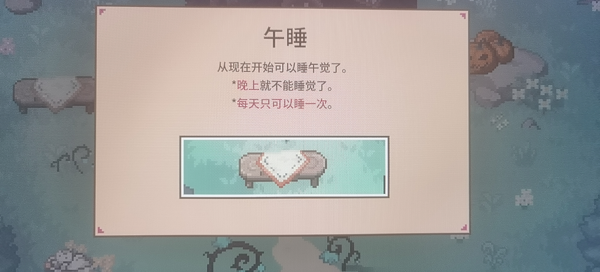
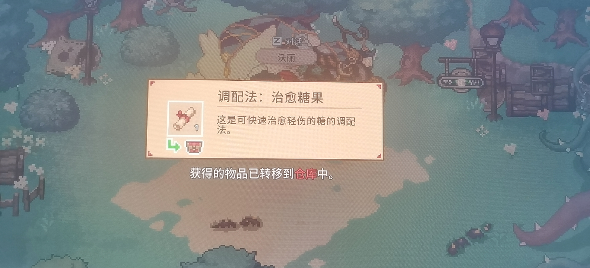

Massive Storage 第一届大学生信息存储技术竞赛 · 挑战赛的代码

# 华为打钱喵华为打钱喵华为打钱喵

终于比完了！华为什么时候打钱？华为什么时候打钱？

# 我什么也做不到

写完啦！steam 启动！

# 我好想玩林中小女巫啊我好想玩林中小女巫啊我好想玩林中小女巫啊我好想玩林中小女巫啊我好想玩林中小女巫啊我好想玩林中小女巫啊我好想玩林中小女巫啊我好想玩林中小女巫啊我好想玩林中小女巫啊我好想玩林中小女巫啊我好想玩林中小女巫啊我好想玩林中小女巫啊我好想玩林中小女巫啊我好想玩林中小女巫啊我好想玩林中小女巫啊我好想玩林中小女巫啊我好想玩林中小女巫啊我好想玩林中小女巫啊

# 女巫圣经


# 其他图片






# 最 ~~新~~ 旧的测试结果！

懒得更新性能测试结果了

很多操作几乎和 cp 一样快了！

```plain
filesize 8GB

108s 75.15 MB/s /bin/cp: 100% cp speed

qin : pop block 1%(3067954/178956971), push block 0%(112/178956971)
qout: pop block 0%(36/178956971), push block 0%(286774/178956971)
152s 53.54 MB/s write p=3 filesize=8589934592: 71% cp speed

qin : pop block 0%(157476/178956970), push block 0%(156/178956970)
qout: pop block 0%(194/178956970), push block 0%(94683/178956970)
116s 70.01 MB/s read p=3 filesize=8589934592: 93% cp speed

qin : pop block 3%(5485984/178956971), push block 0%(161/178956971)
qout: pop block 0%(76/178956971), push block 0%(64891/178956971)
74s 109.22 MB/s repair1 p=3 filesize=8589934592: 145% cp speed

qin : pop block 0%(177450/178956971), push block 0%(87/178956971)
qout: pop block 0%(89/178956971), push block 0%(53859/178956971)
91s 89.04 MB/s repair2 p=3 filesize=8589934592: 118% cp speed

qin : pop block 53%(57097/106312), push block 0%(0/106312)
qout: pop block 0%(0/106312), push block 8%(8580/106312)
108s 75.15 MB/s write p=101 filesize=8589934592: 100% cp speed

qin : pop block 53%(56966/106311), push block 0%(0/106311)
qout: pop block 0%(0/106311), push block 34%(37007/106311)
108s 75.15 MB/s read p=101 filesize=8589934592: 100% cp speed

qin : pop block 10%(10993/106312), push block 0%(0/106312)
qout: pop block 2%(2903/106312), push block 0%(15/106312)
55s 146.28 MB/s repair1 p=101 filesize=8589934592: 194% cp speed

qin : pop block 14%(15822/106312), push block 0%(0/106312)
qout: pop block 0%(0/106312), push block 0%(13/106312)
55s 146.28 MB/s repair2 p=101 filesize=8589934592: 194% cp speed
```

不打算写了。evenodd 再见 :D
