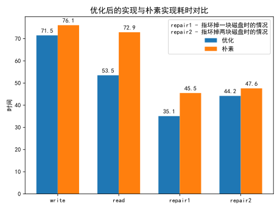
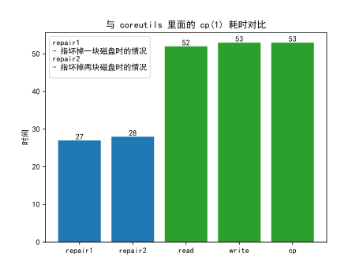
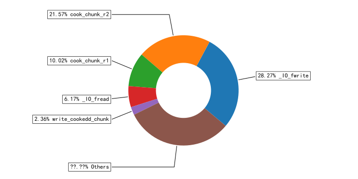

# 优化成果



---

# 优化成果

可以看出，我们的实现至少不会比直接复制文件更慢。



---

# 问题分析



从图中可以看出，程序 io 的时间和计算的时间几乎是相同的。所以优化重点在于优化 io 吞吐量，以及让计算和 io 并行化。从而最大限度地利用硬件能力。

---

# 数据结构设计

计算的基本单元为 `Packet` 类型，内部使用 `uint64_t` 实现。每次可操作 8 B，提升性能。

```plain
+-----+-----+-----+-----+-----+-----+-----+-----+
|byte1|byte2|byte3|byte4|byte5|byte6|byte7|byte8|
+-----+-----+-----+-----+-----+-----+-----+-----+
```

如图为一个 `Packet`

---

# 数据结构设计

假设所选质数为 p，则 (p - 1) * (p + 2) 个 `Packet` 会组成一个 `Chunk`，这是文件读写和修复的基本单位。

```plain
+-----+-----+-----+-----+
| 00  | 01  | 02  | 03  |
+-----|-----|-----|-----+
| 04  | 05  | 06  | 07  |
+-----|-----|-----|-----+
| 08  | 09  | 10  | 11  |
+-----|-----|-----|-----+
| 12  | 13  | 14  | 15  |
+-----|-----|-----|-----+
| 16  | 17  | 18  | 19  |
+-----|-----|-----|-----+
| 20  | 21  | 22  | 23  |
+-----|-----|-----|-----+
| 24  | 25  | 26  | 27  |
+-----+-----+-----+-----+
```

---

# 数据结构设计

写入时，每个磁盘分别存放如下文件：

```plain
+----------------+----------------+---------------+-------+--------------+
| METADATA       | RECORD1        | RECORD2       | ...   | RECORDn      |
+----------------+----------------+---------------+-------+--------------+
```

其中，一个 `RECORD` 是 `Chunk` 中的一行。`METADATA` 是文件的元数据，包含了文件的大小、所使用的质数 p、存储时所用的 `RECORD` 数量等等信息。

---

# 程序结构概览

+ 双线程模型，分为读线程和写线程
+ 计算任务会动态选择较为空闲的线程来完成
+ 读采用 `mmap(2)` 方式，写采用 `fwrite(3)` 方式

---

# 创新：采用多线程方法，自主研发智能任务调度算法

问题：我们已经将程序分为读写两个线程。而不同场景下读写的负载是不同的。比如 write 操作就是读少写多，而 repair 操作则是读多写少。这就意味着，总会有一个线程在等待另外一个线程。我们希望能把线程等待的时间用来做异或计算。

优化前：

```plain
        +-------------------------------------------------------------------
reader  |READ |READ |        |READ |        |READ |         |READ |        |
        +-------------------------------------------------------------------
writer  |     |REPAIR |WRITE |REPAIR |WRITE |REPAIR |WRITE ||REPAIR |WRITE |
        +-------------------------------------------------------------------
```

优化后：

```plain
        +---------------------------------------------------
reader  |READ |READ |REPAIR ||READ |READ |REPAIR | |READ | |                
        +---------------------------------------------------
writer  |     |REPAIR |WRITE |WRITE |REPAIR |WRITE |WRITE ||                 
        +---------------------------------------------------
```

---

# 创新：面向问题特点，优化数据结构的内存布局

```plain
        ROW0  ROW1  ROW2  ROW3
       +-----+-----+-----+-----+
DISK0  | 00  | 01  | 02  | 03  |
       +-----|-----|-----|-----+
DISK1  | 04  | 05  | 06  | 07  |
       +-----|-----|-----|-----+
DISK2  | 08  | 09  | 10  | 11  |
       +-----|-----|-----|-----+
DISK3  | 12  | 13  | 14  | 15  |
       +-----|-----|-----|-----+
DISK4  | 16  | 17  | 18  | 19  |
       +-----|-----|-----|-----+
XDISK5 | 20  | 21  | 22  | 23  |
       +-----|-----|-----|-----+
XDISK6 | 24  | 25  | 26  | 27  |
       +-----+-----+-----+-----+
```

---

# 创新：面向问题特点，优化数据结构的内存布局

- 论文：(p + 2) * (p - 1)
- 我们实现：(p - 1) * (p + 2)，为什么？

该实现方法优点：

+ 转置存储方式：同一个磁盘里所存储的内容在内存里是相邻的，可直接通过 memcpy/fwrite 输入输出。
+ 校验数据放在块尾：一个 Chunk 的前 (p - 1) * p 个 Packet 即是该 Chunk 所存储的原始文件数据，需要使用原始数据时不用额外开销。

```plain
        ROW0  ROW1  ROW2  ROW3
       +-----+-----+-----+-----+
DISK0  | 00  | 01  | 02  | 03  |
       +-----|-----|-----|-----+
DISK1  | 04  | 05  | 06  | 07  |
       +-----|-----|-----|-----+
```

---

# 创新：混合输入/输出方式，适应多种输入情况

## 输入优化

+ 使用 `mmap(2)` 进行读取，减少拷贝次数
+ 使用 `posix_fadvise(2)` 告知内核自己将要顺序读取文件，加大文件预读量。
+ 使用 `madvise(2)` 告知内核自己将顺序访存。

## 输出优化

+ 使用 `fwrite(3)` 进行写入。
+ 使用 128 KB 作为缓冲区大小。
+ 使用 `fallocate(2)` 提前在文件系统里分配好块空间，之后填充即可。可避免大量块分配工作。

---

# 创新：高度抽象读写接口，易于扩展维护

在多次尝试的过程中，我们逐渐抽象出了一套统一的读写接口，取名为 `mmio`。我们将读写模块与程序其他地方隔离，方便进行替换，也方便进行性能测试。

我们尝试了如下读写方法：

+ `mmio.c`：读写全部使用 `mmap(2)` 实现。
+ `mmio-mixed.c`：读采用 `mmap(2)` 实现，写采用 `fwrite(3)` 实现。
+ `mmio-stdio.c`：读写全部采用 `fread(3)` 和 `fwrite(3)` 实现。
+ `mmio-pipe.c`：一种基于管道的零拷贝读写方案。

最后发现 `mmio-mixed` 方案在多种情况下均具有优势，于是选择该方案。

---

# 创新：贴合实际应用场景，使用特别开发的无等待队列

```plain
  out                      in
  |                        |
  v                        v
+-------------------------------+
|ptr|ptr|ptr|ptr|ptr|ptr|ptr|ptr| 队列大小为 2^n
+-------------------------------+
```

代码目录里的 `spsc/` 目录有一个完整的 spsc 无等待队列实现，并且面向题目使用场景特别优化。是程序基础组件之一。

队列并没有使用锁，也没有诸如 `CAS` 之类可能造成较大延时的指令，而是实现了一个基于内存屏障的版本。

程序的线程间通信、内存池都通过该队列完成。

---

# 创新：内存池化，避免多次分配时产生开销

经过性能分析，发现内存分配是程序性能瓶颈之一。

所以我们复用了前面的无等待队列代码，完成了一个内存池。

+ 所有内存块均在 `clean` 队列中
+ 一旦内存块被读线程写入数据，则将其放入 `dirty` 队列中
+ 写线程会从 `dirty` 队列中读取脏块，并且将其写入硬盘
+ 内存块写入硬盘后便可移回 `clean` 队列，等待下次使用

此外，我们还做了根据文件大小动态调整内存池大小的功能，减少内存池初始化的开销。

---

# 创新：内置性能计数器，能够快速排查性能问题

```plain
read thread repaired chunks: 72%(65007930/89478486)
write thread repaired chunks: 27%(24470556/89478486)
dirty_chunks: pop block 0%(3587/89478486),
              push block 0%(0/89478486)
clean_chunks: pop block 19%(17782711/89478486),
              push block 0%(0/89486678)
```

为了方便进行性能分析，找到性能瓶颈，我们在程序内部实现了一组计数器。对队列阻塞情况和线程分配到的计算任务进行统计。

---

# 创新：自动化测试为程序正确性保驾护航

为了保证程序的正确性，我们自主研发了一组测试脚本。它能自动生成各种情况的测试用例，并且智能检查结果正确性。它拥有以下几个方面的自由度：

1. 文件大小
2. 文件大小的对齐量（2 的整数次幂）
3. 质数 p 的取值
4. 磁盘损坏的方式（包括坏掉 1 个磁盘的三种情况和坏掉 2 块磁盘的四种情况）
5. 文件名

---

# 其他小优化

+ 论文中其实有一个小笔误，会产生错误的结果。我们在实现程序时发现了这一点并在代码里修复了。
+ 原论文中使用了大量取模相关的操作，我们通过对程序访存的分析，使用各种小技巧尽可能减少了取模操作的使用，提高了计算速度。
+ 我们针对目标平台简单调整了一下访存的顺序。
+ 之前每个 Chunk 都要判断磁盘坏掉的情况属于哪一种，有很多分支，非常慢。于是把修复的操作抽象了一下，每种情况编写了一个函数，用函数指针来调用对应的代码。这样只要在程序开头判断一次坏掉的情况，并且把函数指针设置好，后面就不用再判断了。
+ 劳逸结合，队员经常一起打游戏，放松身心也能促进团队交流协作。

---

# 提问时间
